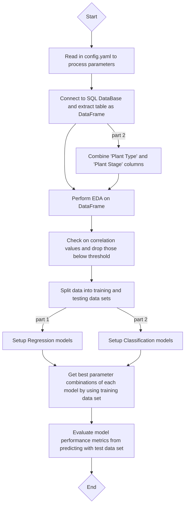

# aiap19-ng-chuan-seng-611J
Repository for AIAP December 2024 technical assessment attempt

## Personal Information
- Name: Ng Chuan Seng
- Email Address: CNG043@e.ntu.edu.sg

## Folder Structure Overview
```md
root
├── .github
├── src
|   ├── cfg
|   |   └── config.yaml
|   ├── EDA
|   |   ├── __init__.py
|   |   ├── eda_addon.py
|   |   └── eda_step.py
|   ├── log
|   |   ├── __init__.py
|   |   └── log_setup.py
|   ├── model_eval
|   |   ├── __init__.py
|   |   └── model_eval.py
|   ├── model_select
|   |   ├── __init__.py
|   |   └── model_select.py
|   ├── setup
|   |   ├── __init__.py
|   |   ├── duration_cal.py
|   |   └── setup.py
├── main.py
├── .gitignore
├── eda.ipynb
├── LICENSE
├── README.md
├── requirements.txt
└── run.sh
```

## Pipeline Instructions
- To kick-off the pipeline, execute run.sh at the root directory
    - It will navigate into the src directory and execute the pipeline automatically
- To modify parameters related to the models, features or database paths, navigate to `./src/cfg/config.yaml` and modify the corresponding parameter of interest

## Pipeline Flow
1. Read in config.yaml to process user-config and parameters set
2. Connect to SQL DataBase as defined by path in config.yaml and extract table from SQL Database as DataFrame
3. Perform exploratory data analysis on DataFrame for both part 1 (Regression) and part 2 (Classification)
    - Perform feature engineering (Label encoding, one-hot encoding, standardized scaling)
    - Check on correlation values of target variable against others and drop features' value that are below defined threshold
    - Split data into training and testing data sets for subsequent steps
4. Perform selected model setup for both part 1 and part 2, and run through defined parameters to get best combination
5. Evaluate model performance by monitoring the metrics from predicting the test set

### Visualization


## Task 1 (EDA) Key Findings
- 'Humidity Sensor' column has many missing values
    - The column is dropped as replacing the cells with the median or mean values would induce huge bias that might affect the overall results
- There are some columns with missing values, non-standardized naming, negative values, and values with metric units
    - Rows with missing values are dropped as replacing the cells with the median or mean values would induce some bias that might affect the overall results
    - Non-standardized naming are set to all lowercases
    - Absolute value of negative values are taken to make them positive
    - Metric units are removed to make values numeric
- 'Plant Stage' is label encoded as the data is ordered
- Columns with 'object' type data are one-hot encoded, if not label encoded
- Remaining columns are standardized scaled
- Combine 'Plant Type' and 'Plant Stage' to form 'Plant Type-Stage'
    - Drop 'Plant Type' and 'Plant Stage' columns to avoid having direct correlation with new column

## Dataset Features
### Part 1 Regression
| Feature | Processing | Feature Engineering |
| :-----: | :--------: | :--: |
| Humidity Sensor | Drop column | - |
| Temperature Sensor | Drop rows with missing value | Standardized Scaling |
| | Remove negative sign | |
| Light Intensity Sensor | Drop rows with missing value | Standardized Scaling |
| Nutrient N Sensor | Drop rows with missing value | Standardized Scaling |
| | Remove metric units (ppm) | |
| Nutrient P Sensor | Drop rows with missing value | Standardized Scaling |
| | Remove metric units (ppm) | |
| Nutrient K Sensor | Drop rows with missing value | Standardized Scaling |
| | Remove metric units (ppm) | |
| Water Level Sensor | Drop rows with missing value | Standardized Scaling |
| Plant Stage | Lowercase all values | Label Encoding |
| Plant Type | Lowercase all values | One-hot Encoding |
| System Location Code | - | One-hot Encoding |
| Previous Cycle Plant Type | - | One-hot Encoding |
| CO2 Sensor | - | Standardized Scaling |
| EC Sensor | - | Standardized Scaling |
| O2 Sensor | - | Standardized Scaling |
| pH Sensor | - | Standardized Scaling |

### Part 2 Classification
| Feature | Processing | Feature Engineering |
| :-----: | :--------: | :--: |
| Humidity Sensor | Drop column | - |
| Plant Stage | Lowercase all values | - |
| | Drop column | |
| Plant Type | Lowercase all values | - |
| | Drop column | |
| Temperature Sensor | Drop rows with missing value | Standardized Scaling |
| | Remove negative sign | |
| Light Intensity Sensor | Drop rows with missing value | Standardized Scaling |
| Nutrient N Sensor | Drop rows with missing value | Standardized Scaling |
| | Remove metric units (ppm) | |
| Nutrient P Sensor | Drop rows with missing value | Standardized Scaling |
| | Remove metric units (ppm) | |
| Nutrient K Sensor | Drop rows with missing value | Standardized Scaling |
| | Remove metric units (ppm) | |
| Water Level Sensor | Drop rows with missing value | Standardized Scaling |
| Plant Type-Stage | - | Label Encoding |
| System Location Code | - | One-hot Encoding |
| Previous Cycle Plant Type | - | One-hot Encoding |
| CO2 Sensor | - | Standardized Scaling |
| EC Sensor | - | Standardized Scaling |
| O2 Sensor | - | Standardized Scaling |
| pH Sensor | - | Standardized Scaling |

## Model Choice
- Regression
    - Linear Regression
    - Random Forest Regressor
    - XGBoost Regressor
- Classification
    - Logistic Regression
    - Random Forest Classifier
    - XGBoost Classifier

## Model Evaluation
- Regression
    - Linear Regression
    - Random Forest Regressor
    - XGBoost Regressor
- Classification
    - Logistic Regression
    - Random Forest Classifier
    - XGBoost Classifier

## Other Considerations
- Regression
- Classification