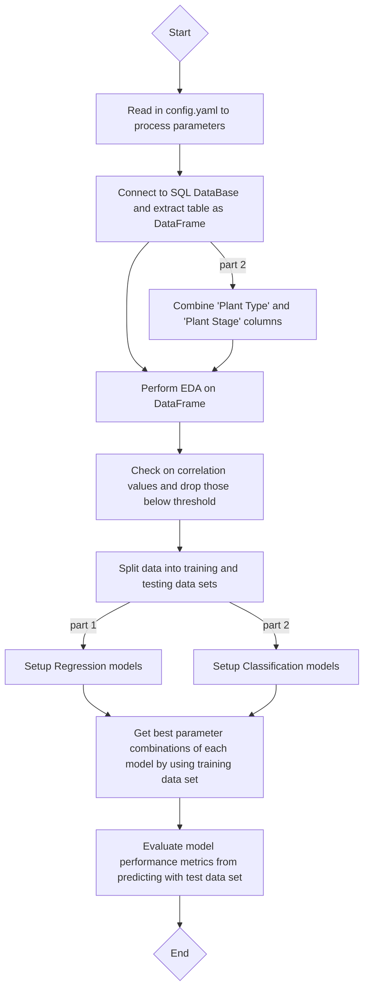

# aiap19-ng-chuan-seng-611J
Repository for AIAP December 2024 technical assessment attempt

## Personal Information
- Name: Ng Chuan Seng
- Email Address: CNG043@e.ntu.edu.sg

## Folder Structure Overview
```md
root
├── .github                  # Github actions
├── src
|   ├── cfg
|   |   └── config.yaml      # User-config parameter
|   ├── EDA
|   |   ├── __init__.py
|   |   ├── eda_addon.py     # EDA addon - Feature engineering/Correlation evalution/Model preparation
|   |   └── eda_step.py      # EDA top wrapper
|   ├── log
|   |   ├── __init__.py
|   |   └── log_setup.py     # Runtime logger setup
|   ├── model_eval
|   |   ├── __init__.py
|   |   └── model_eval.py    # Model performance evaluation
|   ├── model_select
|   |   ├── __init__.py
|   |   └── model_select.py  # Model selection setup
|   ├── setup
|   |   ├── __init__.py
|   |   ├── duration_cal.py  # Runtime calculation
|   |   └── setup.py         # User-config parameter setup
|   ├── main.py              # Top wrapper
|   └── ml_model.log         # Run log (Only available after first run)
├── .gitignore
├── eda.ipynb                # Part 1 EDA Jupyter notebook
├── LICENSE
├── README.md                # Current file
├── requirements.txt         # Virtual environment library setup
└── run.sh                   # Trigger file
```

## Pipeline Instructions
- To kick-off the pipeline, execute run.sh at the root directory
    - It will navigate into the src directory and execute the pipeline automatically
- To modify parameters related to the models, features or database paths, navigate to `./src/cfg/config.yaml` and modify the corresponding parameter of interest

## Pipeline Flow
1. Read in config.yaml to process user-config and parameters set
2. Connect to SQL DataBase as defined by path in config.yaml and extract table from SQL Database as DataFrame
3. Perform exploratory data analysis on DataFrame for both part 1 (Regression) and part 2 (Classification)
    - Perform feature engineering (Label encoding, one-hot encoding, standardized scaling)
    - Check on correlation values of target variable against others and drop features' value that are below defined threshold
    - Split data into training and testing data sets for subsequent steps
4. Perform selected model setup for both part 1 and part 2, and run through defined parameters to get best combination
5. Evaluate model performance by monitoring the metrics from predicting the test set
6. The model details can be analyzed in ml_model.log after the run
    - Contains model runtime, best model parameter combination and model metrics

### Visualization


## Task 1 (EDA) Key Findings
- 'Humidity Sensor' column has many missing values
    - The column is dropped as replacing the cells with the median or mean values would induce huge bias that might affect the overall results
- There are some columns with missing values, non-standardized naming, negative values, and values with metric units
    - Rows with missing values are dropped as replacing the cells with the median or mean values would induce some bias that might affect the overall results
    - Non-standardized naming are set to all lowercases
    - Absolute value of negative values are taken to make them positive
    - Metric units are removed to make values numeric
- 'Plant Stage' is label encoded as the data is ordered
- Columns with 'object' type data are one-hot encoded, if not label encoded
- Remaining columns are standardized scaled
- Combine 'Plant Type' and 'Plant Stage' to form 'Plant Type-Stage'
    - Drop 'Plant Type' and 'Plant Stage' columns to avoid having direct correlation with new column

## Dataset Features
### Part 1 Regression
| Feature | Processing | Feature Engineering |
| :-----: | :--------: | :--: |
| Humidity Sensor | Drop column | - |
| Temperature Sensor | Drop rows with missing value | Standardized Scaling |
| | Remove negative sign | |
| Light Intensity Sensor | Drop rows with missing value | Standardized Scaling |
| Nutrient N Sensor | Drop rows with missing value | Standardized Scaling |
| | Remove metric units (ppm) | |
| Nutrient P Sensor | Drop rows with missing value | Standardized Scaling |
| | Remove metric units (ppm) | |
| Nutrient K Sensor | Drop rows with missing value | Standardized Scaling |
| | Remove metric units (ppm) | |
| Water Level Sensor | Drop rows with missing value | Standardized Scaling |
| Plant Stage | Lowercase all values | Label Encoding |
| Plant Type | Lowercase all values | One-hot Encoding |
| System Location Code | - | One-hot Encoding |
| Previous Cycle Plant Type | - | One-hot Encoding |
| CO2 Sensor | - | Standardized Scaling |
| EC Sensor | - | Standardized Scaling |
| O2 Sensor | - | Standardized Scaling |
| pH Sensor | - | Standardized Scaling |
<br>

### Part 2 Classification
| Feature | Processing | Feature Engineering |
| :-----: | :--------: | :--: |
| Humidity Sensor | Drop column | - |
| Plant Stage | Lowercase all values | - |
| | Drop column | |
| Plant Type | Lowercase all values | - |
| | Drop column | |
| Temperature Sensor | Drop rows with missing value | Standardized Scaling |
| | Remove negative sign | |
| Light Intensity Sensor | Drop rows with missing value | Standardized Scaling |
| Nutrient N Sensor | Drop rows with missing value | Standardized Scaling |
| | Remove metric units (ppm) | |
| Nutrient P Sensor | Drop rows with missing value | Standardized Scaling |
| | Remove metric units (ppm) | |
| Nutrient K Sensor | Drop rows with missing value | Standardized Scaling |
| | Remove metric units (ppm) | |
| Water Level Sensor | Drop rows with missing value | Standardized Scaling |
| Plant Type-Stage | - | Label Encoding |
| System Location Code | - | One-hot Encoding |
| Previous Cycle Plant Type | - | One-hot Encoding |
| CO2 Sensor | - | Standardized Scaling |
| EC Sensor | - | Standardized Scaling |
| O2 Sensor | - | Standardized Scaling |
| pH Sensor | - | Standardized Scaling |

## Model Choice
- Regression
    - Linear Regression
        - Used as a starting-point (Base-line model)
        - Easily interpretable - Can easily see how each feature affects the target variable (Temperature Sensor)
        - Test data set on linear relationship between target variable and other features
        - Computationally efficient in terms of resource usage
    - Random Forest Regressor
        - Combines multiple decision trees to capture complex, non-linear relationship in the data
        - Less prone to overfitting
        - Automatically handles feature interaction without needing to manually create interaction terms 
    - XGBoost Regressor
        - High predictive power - XGBoost is an advanced gradient boosting algorithm
        - Handles non-linearity and feature interaction - Similar to Random Forest Regressor
        - Built-in regularization to prevent overfitting when dealing with noisy or complex datasets
        - Wide range of hyper-parameters to tune - Allowing for further performance optimization
- Classification
    - Logistic Regression
        - Used as a starting-point (Base-line model)
        - Easily interpretable - Can easily see how each feature affects the target variable (Plant Type-Stage)
        - Can be used for multi-class classification
    - Random Forest Classifier
        - Combines multiple decision trees to capture complex, non-linear relationship in the data
        - Robustness to overfitting
        - Handles numerical and categorical features well without needing for extensive preprocessing
    - Multi-Layer Perceptron (MLP) Classifier
        - Can learn complex non-linear relationships between features and target
        - Flexible model that can be adapted to different types of classification problems (Binary or multi-class)
        - Can be configured with various numbers of hidden layers and neurons

## Model Evaluation
### Regression
- Metrics used
    - Mean Squared Error
        - Used when minimizing prediction error is of importance
        - Provides indication of how well model is fitting to data
        - More sensitive to outliers and gives a sense of error magnitude
        - Lower value = Better model predictive accuracy
    - R2 Score
        - Used to understand how well model is explaining variance in data (Variance = Variability/spread of target variable)
        - Determine how well model captures underlying patterns in data
        - Might not be accurate if model is overfitting or contains outliers
        - Higher value = Higher percentage of variance is explained by model
- Since this regression is to predict the temperature value, prediction error is of importance
- Hence, mean squared error needs to be monitored, along with r2 score to ensure that the model is not overfitted

### Regression Model Results
| Model | Mean Squared Error | R2 Score |
| :---: | :----------------: | :------: |
| Linear Regression | 0.5126 | 0.4975 |
| Random Forest Regressor | 0.3154 | 0.6908 |
| XGBoost Regressor | 0.3381 | 0.6686 |

### Regression Model Evaluation
As seen in the table above, Linear Regression model has the largest Mean Squared Error (MSE) and smallest R2 Score values <br>
This means that the relationship between target and features is not linear <br>
As for the other two models, they have similar values for both MSE and R2 Score <br>
However, Random Forest Regressor has a smaller MSE and larger R2 Score value than XGBoost Regressor <br>
This could be due to a narrow range of hyperparameter values defined for XGBoost Regressor during the GridSearchCV step <br>
This can be improved by increasing the range of hyperparameter values but this would also mean that the runtime would increase due to the increase in possible combinations <br>

---
<br>

### Classification
- Metrics used
    - Confusion Matrix
        - Helps to visualize performance of model by showing number of correct and incorrect predictions for each class
        - Helps to identify errors (false positives and false negatives) and assess how well model is performing
    - Classification Report
        - Provides detailed performance evaluation of model by calculating precision, recall, f1-score, and support for each class
        - Useful in situations where there are imabalanced classes or need to evaluate model's behaviour for each class
- The confusion matrix provides a quick overview of the model's classification results
- The classification report provides an overview of the performance of each target class

### Classification Sub-metric Description
| Metric | Description |
| :----: | :---------: |
| Precision | Proportion of instances predicted as particular class actually belongs to said class |
| Recall | Proportion of actual instances of a class are correctly identified by model |
| F1-Score | Harmonic mean of precision and recall |
| Support | Number of occurences of each class in dataset |

### Classification Model Results
| Model | Accuracy | Precision (Avg) | Recall (Avg) | F1-Score (Avg) |
| :---: | :------: | :-------: | :----: | :------: |
| Logistic Regression | 0.76 | 0.75 | 0.75 | 0.75 |
| Random Forest Classifier | 0.83 | 0.82 | 0.83 | 0.82 |
| MLP Classifier | 0.80 | 0.80 | 0.80 | 0.80 |

### Classification Model Evaluation
As seen in above table, Logistic Regression has the lowest values for all metrics <br>
This means that while the model can classify the data to the correct class using a linear relationship, there is a 24% chance that the data could be incorrectly classified <br>
Random Forest Classifier performed the best among the three models <br>
It means that the processed data have a complex and non-linear relationship with the target <br>
These metric values could be further improved if the data was processed better during the EDA and feature engineering stages <br>
As for the MLP Classifier, its performance is similar to that of Random Forest Classifier but the shortfall could be due to the range of hyperparameters defined <br>
The number of hidden layers and neurons defined in the list could be increased to allow GridSearchCV to output a better combination

## Other Considerations
- Regression:
    - Model run-time
    - Number of model parameters defined
- Classification
    - Model run-time
    - Number of model parameters defined